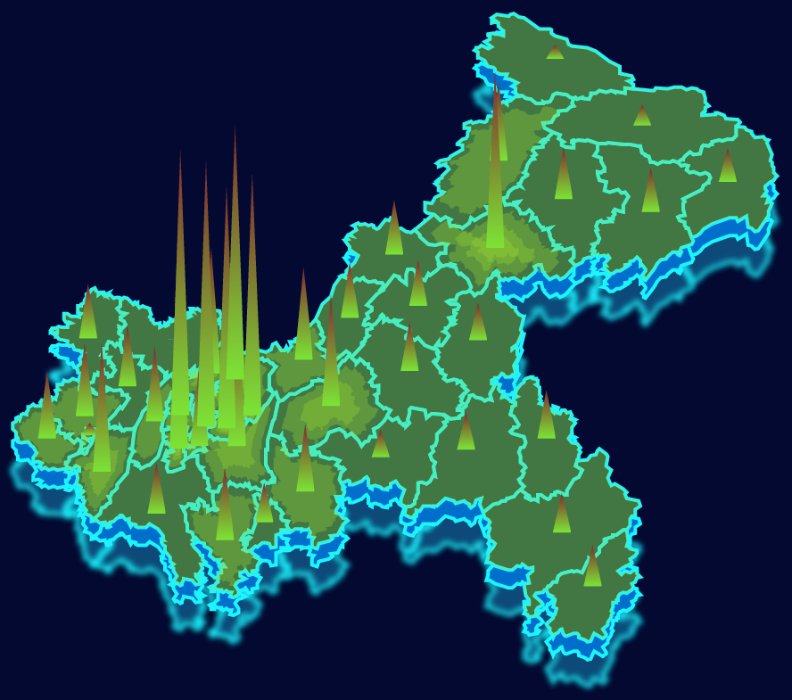

##技侦项目地图组件说明文档

###1 使用说明
```
//引入D3文件
require('../../lib/d3.v3')

//引入地图组件
var GradientMap = require('./src/levelGradientMap.js')

//默认数据，真实开发环境下使用以下值代替
//window.X：x方向的缩放比例
window.X = 1

//window.Y：y方向的缩放比例
window.Y = 1

//公用常量，表示当前点击的值的名称
window.GLOBAL_TIME_OBJ = {
    typeName: '全市案件数'
}

//配置参数
//scale表示地图缩放比例
var config = {
    width: 1448,
    height: 800,
    mapDeep: 0,
    scale: 10000
}

//创建地图组件实例
//#container表示页面容器, config表示配置参数
var gradientMap = new GradientMap('#container', config)

//读取重庆地区json文件
d3.json("./chongqingtopo.json", function(error, toporoot) {
    if (error) {
        return console.error(error);
    }

    var root = topojson.feature(toporoot, toporoot.objects.chongqing)

    //显示底层阴影
    gradientMap.showmap("shadowend", "#178dc3", root.features, 0, 50);
    //显示二层阴影
    gradientMap.showmap("shadow", "#6bfdff", root.features, 0, 30);
    //显示阴影
    gradientMap.showmap("shadow", "#006ecb", root.features, 0, 20);

    /**
        * 读取测试数据，真实情况下通过ajax请求后台数据
        */
    d3.json('./data.json', function(err, result) {
        var mapData = result.troopsMap

        //获取返回值中的最大值
        var maxValue = d3.max(mapData, function(d, i) {
            return parseInt(d.value, 10)
        })
        
        var areaUnit = maxValue/6
        var unit = maxValue/300
        unit = unit.toFixed(2)
        
        //显示地图
        gradientMap.showmap("map", "#1a4a4e", root.features, 0, 0, mapData);

        //按行政区域绘制地图
        //绘制绿色区域
        for (var i = 0; i < mapData.length; i++) {
            for (var j = 0; j < root.features.length; j++) {
                if (root.features[j].properties.name == mapData[i].key) {
                    gradientMap.showoverView("overView" + i, root.features[j], Math.round(mapData[i].value/areaUnit), mapData[i].value);
                }
            }
        }

        //绘制尖尖
        for (var i = 0; i < mapData.length; i++) {
            for (var j = 0; j < root.features.length; j++) {
                if (root.features[j].properties.name == mapData[i].key) {
                    gradientMap.showTips("Tips", root.features[j], mapData[i].value/unit, mapData[i].value)
                }
            }
        }
    })
})
```

###2 效果展示



###3 接口说明
####3.1 接口调用
调用方式：

```
    /**
        实例化地图组件
        @param {string} container 页面容器
        @param {object} config 配置参数
    */
    var gradientMap = new GradientMap(container, config)

    /**
        * 绘制地图
        * @param {string}  name 当前绘制地图的名称
        * @param {string}  color 颜色
        * @param {array}  data 绘制地图所需要的数据
        * @param {number}  x left方向值
        * @param {number} y top方向值
        * @param {string}  value 提示框上显示的值
    */
    gradientMap.showmap(name, color, data, x, y, value)

    /**
        * 绘制地图绿色区域
        * @param {string}  name 当前绘制地图的名称
        * @param {array}  data 绘制地图所需要的数据
        * @param {number}  leve 根据value获取的层级值，范围1-6，值越大，颜色越浓
        * @param {string}  value 提示框上显示的值
    */
    gradientMap.showoverView(name, data, leve, value)

    /**
        * 绘制地图尖顶部分
        * @param {string}  name 当前绘制地图的名称
        * @param {array}  data 绘制地图所需要的数据
        * @param {number}  leve 根据value获取的层级值，范围1-500，值越大，尖尖越高
        * @param {string}  value 提示框上显示的值
    */
    gradientMap.showTips(name, data, leve, value)
```

### 4 配置项字段说明

| 字段      | 含义                  | 是否必选 | 默认值  | 备注   |
| ------- | ------------------- | ---- | ---- | ---- |
| width   | svg宽度               | 是    | 无    |      |
| height  | svg高度               | 是    | 无    |      |
| mapDeep | 用于微调map translate的值 | 否    | 0    |      |
| scale   | 地图缩放比例              | 是    | 无    |      |

