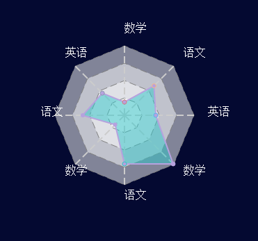

##标准雷达图组件说明文档

###1 使用说明
```
var circleArc = require('normalRadarChart')

//容器宽度和高度
var width = 540
var height = 400

var config = {
    r: 100,
    level: 4,
    min: 0,
    max: 100,
    arc: 2*Math.PI,
    fixed: false,
    count: 8,
    polygon: {
        fill: 'white',
        fillOpacity: 0.5,
        stroke: 'gray',
        strokeDasharray: '10 5'
    },
    lines: {
        stroke: '#ccc',
        strokeWidth: 2,
        strokeDasharray: '10 5'
    },
    areas: {
        fillOpacity: 0.5,
        fill: '#2ec7c9',
        strokeWidth: 2,
        stroke: '#b6a2de'
    },
    points: {
        show: true,
        fill: '#b6a2de',//['', '']
        stroke: ['#2ec7c9', '#b6a2de', '#5ab1ef', '#ffb980', '#d87a80',
        '#8d98b3'],
        r: 3
    },
    texts: {
        show: true,
        fill: 'white',
        fontSize: 16,
        offset: 20
    }
}

var data = [
    {
        name: '语文',
        value: 70
    },
    {
        name: '数学',
        value: 99
    },
    {
        name: '英语',
        value: 45
    },
    {
        name: '语文',
        value: 60
    },
    {
        name: '数学',
        value: 19
    },
    {
        name: '英语',
        value: 45
    },
    {
        name: '语文',
        value: 60
    },
    {
        name: '数学',
        value: 19
    }
]

//container为页面div元素的ID
var svg = d3.select('#container')
    .append('svg')
    .attr('width', width)
    .attr('height', height)
    .append('g')
    .attr('class', 'radar-chart')
    .attr('transform', 'translate(' + width/2 + ',' + height/2 + ')')

radarChart.drawRadarChart(svg, data, config)
```

###2 效果展示



###3 接口说明
####3.1 接口调用
调用方式：`radarChart.drawRadarChart(svg, data, config)`

参数说明：

- svg: svg实例
- data：数据
- config：配置项


### 4 配置项字段说明

| 字段          | 含义    | 是否必选 | 默认值     | 备注   |
| ----------- | ----- | ---- | ------- | ---- |
| r       | 雷达图半径大小 | 否    | 200     |      |
| level      | 雷达图层级 | 否    | 4     |   从内到外显示的层级   |
| min | 最小值   | 否    | 0 |      | 调整雷达图坐标时候需要用到 |
| max | 最大值   | 否    | 100   |  调整雷达图坐标时候需要用到    |
| arc       | 雷达图覆盖的弧度范围 | 否    | 2*Math.PI     |      |
| fixed       | 是否固定雷达图顶点个数 | 否    | false     |  如果fixed为false，则雷达图根据数据个数变化    |
| count       | 默认雷达图顶点个数 | 否    | 8     |  当fixed为true时候需要    |
| polygon      | 雷达图网格样式 |     |      |      |
| polygon.fill      | 雷达图网格填充色 | 否    | white     |      |
| polygon.fillOpacity       | 雷达图网格透明度 | 否    | 0.5     |      |
| polygon.stroke       | 雷达图网格边框颜色 | 否    | gray     |      |
| polygon.strokeDasharray       | 雷达图网格边框线的样式 | 否    | 10 5     |      |
| lines       | 雷达图交叉线的样式对象 |     |      |      |
| lines.stroke       | 雷达图交叉线的颜色 | 否    | #ccc     |      |
| lines.strokeWidth       | 雷达图交叉线的宽度 | 否    | 2     |      |
| lines.strokeDasharray       | 雷达图交叉线的样式 | 否    | 10 5     |      |
| areas       | 雷达图面积样式对象 |     |      |      |
| areas.fillOpacity       | 雷达图面积透明度 | 否    | 0.5     |      |
| areas.fill       | 雷达图面积填充色 | 否    | #2ec7c9     |      |
| areas.strokeWidth       | 雷达图面积边框线宽度 | 否    | 2     |      |
| areas.stroke       | 雷达图面积边框线颜色 | 否    | #b6a2de     |      |
| points       | 雷达图面积上各个连接处的小圆点样式对象 | 否    | 200     |      |
| points.show       | 是否显示各个连接处的小圆点 | 否    | true     |      |
| points.fill       | 各个连接处的小圆点的填充色 | 否    | #b6a2de     | 该值可以省略，可以传一个字符串，表示所有的都是同一个颜色，也可以传一个数组，表示每个颜色都不同    |
| points.stroke       | 各个连接处的小圆点的边框颜色 | 否    | #2ec7c9     | 该值可以省略，可以传字符串，也可以传一个数组     |
| points.r       | 各个连接处的小圆点的半径大小 | 否    | 3     |      |
| texts       | 雷达图上文本样式对象 |     |      |      |
| texts.show       | 是否在雷达图外显示文本信息 | 否    | true     |      |
| texts.fill       | 文本颜色 | 否    | white     |      |
| texts.fontSize       | 文本字体大小 | 否    | 16     |      |
| texts.offset       | 文本偏移量 | 否    | 20     | 用于微调文本位置     |

