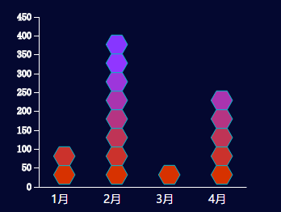

##多边形柱状图说明文档

###1 使用说明
```
var bar = require('polygonBar)
var width = 340
var height = 270
var config = {
    width: width,
    height: height,
    min: 1,
    scale: 1,
    zoom: 6,
    color: ['#d63200', '#9936e8'],
    //coordinate: [130,20, 20,40, 20,220, 130,200, 220,220, 220,40] , //六边形的六个坐标点
    coordinate: [60,20, 20,90, 60,160, 140,160, 180,90, 140,20], //正六边形的六个坐标点
    itemStyle:{
      strokeWidth: 1,
      stroke: '#06b7c7',
      margin: {
        left: 65
      }
    },
    yAxis: {
      show: true
    },
    xAxis: {
      color: '#fff'
    },
     xText: {
      size: 14,
      color: '#fff',
      textAnchor: 'start'
    },
    grid: {  //文字离左右两边的距离
      x: 50,
      y: 60
    }
}
var data = [
    {
      name: "1月",
      value: 150
    },{
      name: "2月",
      value: 450
    },{
      name: "3月",
      value: 50
    },{
      name: "4月",
      value: 300
    }
  ]
var svg = d3.select('body')
    .append('svg')
    .attr('width', width)
    .attr('height', height)

bar.drawPolygonBar(svg, data, config);
```
###2 效果展示



###3 接口说明
####3.1 接口调用
调用方式：`bar.drawPolygonBar(svg, data, config)`

参数说明：

- svg: svg实例
- data：数据
- config：配置项

### 配置项参数说明

| 字段                           | 含义          | 是否必选 | 默认值                                      | 备注                      |
| ---------------------------- | ----------- | ---- | ---------------------------------------- | ----------------------- |
| width                 | svg宽度       | 是    | 无                                        |                         |
| height                | svg高度       | 是    | 无                                        |                         |
| fontFamily            | 字体样式        | 否    | 微软雅黑                                     |                         |
| min                   | 刻度最少个数      | 否    | 1                                        |                         |
| scale                 | 比例          | 否    | 1                                        |                         |
| zoom                  | 缩放倍数        | 否    | 6                                        |                         |
| color                 | 填充渐变色       | 否    | ['#d63200', '#9936e8']                   |                         |
| coordinate            | 多边形坐标点      | 否    | [130,20, 20,40, 20,220, 130,200, 220,220, 220,40] |                         |
| itemStyle             | 多边形样式       | 否    | 无                                        |                         |
| itemStyle.strokeWidth | 边框宽         | 否    | 1                                        |                         |
| itemStyle.stroke      | 边框颜色        | 否    |                                          |                         |
| itemStyle.margin.left | 多边形离y轴标尺的距离 | 否    | 30                                       | 类型样式为tilt有效             |
| itemStyle.margin.left | 离y轴标尺的距离    | 否    | 65                                       | 类型样式为circle有效           |
| itemStyle.margin.left | 矩形离左边文字的距离  | 否    | 10                                       |                         |
| xText                 | x轴字体样式      | 否    | 无                                        |                         |
| xText.fontSize        | 字体大小        | 否    | 14                                       |                         |
| xText.color           | 字体颜色        | 否    | #fff                                     |                         |
| xText.textAnchor      | 对齐方向        | 否    | start                                    | start, middle, end(左中右) |
| yAxis                 | y轴坐标        | 否    | 无                                        |                         |
| yAxis.show            | 是否显示y轴坐标    | 否    | true                                     |                         |
| yAxis                 | x轴轴线        | 否    | 无                                        |                         |
| yAxis.color           | x轴轴线颜色      | 否    | #fff                                     |                         |
| grid                  | 文字离左右两边的距离  | 否    | 无                                        | 如文字太长，显示不完可改变其值         |
| grid.x                | 文字离左边的距离    | 否    | 50                                       |                         |
| grid.y                | 文字离底部的距离    | 否    | 60                                       |                         |


