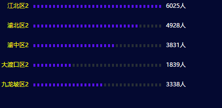

##刻度柱状图说明文档

###1 使用说明
```
var splitBar = require('splitBar)

var width = 400
var height = 200

var config = {
  width: width,
  height: height,
  fontFamily: '微软雅黑',
  min: 1,
  itemStyle: {
    width: 4,
    height: 6,
    color: ['#5810ed', '#282f36'],
    spacing: 4, //小方块之间的间距
    symbol: 'tilt',  //方块类型（矩形rect，平行四边形tilt，椭圆circle）
    skewX: 30,  //倾斜角度
    radius: 3,  //椭圆的半径
    margin: {
      left:10,
      right:10
    },
  },
  leftText: {
    fontSize: 12,
    color: 'yellow',
    textAnchor: 'end'
  },
  rightText: {
    fontSize: 12,
    color: '#fff',
    textAnchor: 'middle'
  },
  grid: {
    x: 60,
    x2: 40
  }

}

var data = [
  {
    name: "江北区",
    value: 6025
  },{
    name: "渝北区",
    value: 4928
  },{
    name: "渝中区",
    value: 3831
  },{
    name: "大渡口区",
    value: 1839
  },{
    name: "九龙坡区",
    value: 3338
  }
]

var svg = d3.select('body')
    .append("svg")
    .attr("width", width)
    .attr("height", height)
    .style('padding-top', '10px')

splitBar.drawSplitBar(svg, data, config)
```

###2 效果展示



###3 接口说明

####3.1 接口调用
调用方式：`splitBar.drawSplitBar(svg, data, config)`

参数说明：

- svg: svg实例
- data：数据
- config：配置项


### 配置项参数说明

| 字段                           | 含义         | 是否必选 | 默认值                    | 备注                                |
| ---------------------------- | ---------- | ---- | ---------------------- | --------------------------------- |
| width                 | svg宽度      | 是    | 400                     |                                   |
| height                | svg高度      | 是    | 200                      |                                   |
| fontFamily            | 字体样式       | 否    | 微软雅黑                   |                                   |
| min                   | 刻度最少个数     | 否    | 1                      |                                   |
| itemStyle             | 刻度样式（小矩形框） | 否    | 无                      |                                   |
| itemStyle.width       | 单个矩形宽度     | 否    | 4                      |                                   |
| itemStyle.height      | 单个矩形高度     | 否    | 6                      |                                   |
| itemStyle.color       | 矩形颜色       | 否    | ['#5810ed', '#282f36'] | [0]数据填充颜色/[1]背景填充颜色               |
| itemStyle.spacing     | 矩形之间的间距    | 否    | 4                      |                                   |
| itemStyle.symbol      | 矩形类型样式     | 否    | tilt                   | 三个可选参数（矩形rect，平行四边形tilt，椭圆circle） |
| itemStyle.skewX       | 倾斜角度       | 否    | 30                     | 类型样式为tilt有效                       |
| itemStyle.radius      | 椭圆的半径      | 否    | 3                      | 类型样式为circle有效                     |
| itemStyle.margin.left | 矩形离左边文字的距离 | 否    | 10                     |                                   |
| leftText              | 左边字体样式     | 否    | 无                      |                                   |
| leftText.fontSize     | 字体大小       | 否    | 12                     |                                   |
| leftText.color        | 字体颜色       | 否    | yellow                 |                                   |
| leftText.textAnchor   | 对齐方向       | 否    | end                    | start, middle, end(左中右)           |
| rightText             | 右边字体样式     | 否    | 无                      |                                   |
| rightText.fontSize    | 字体大小       | 否    | 40                     |                                   |
| rightText.color       | 字体颜色       | 否    | #fff                   |                                   |
| rightText.textAnchor  | 对齐方向       | 否    | middle                 | start, middle, end(左中右)           |
| grid                  | 文字离左右两边的距离 | 否    | 无                      | 如文字太长，显示不完可改变其值                   |
| grid.x                | 文字离左边的距离   | 否    | 60                     | 包括left，right，top和bottom四个值        |
| grid.x2               | 文字离右边的距离   | 否    | 40                     |                                   |

