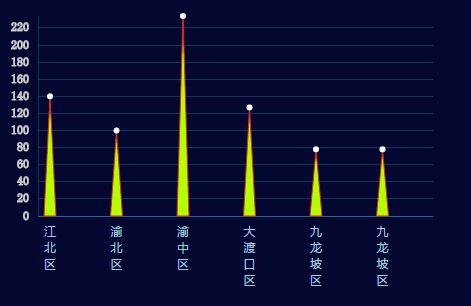

##三角形柱状图说明文档

###1 使用说明
```
var bar = require('triangleBar')

var width = 450
var height = 280

var config = {
    width: width,
    height: height,
    itemStyle: {
      barWidth: 6,
      color: ['#b3ff03', '#54a707'],
      borderColor: '#de2528',
      borderWidth: 1,
      circle:{
        color:'#fff',
        r: 3,
      }
    },
    xText:{
      fontSize: 12,
      color: '#a5cfe0',
      textAnchor: 'middle'
    },
    xAxis: {
      color: '#2c668e'
    },
    grid:{
      x: 45,
      y: 60,
      y2:20
    }
  }

var svg = d3.select('body')
    .append('svg')
    .attr('width', width)
    .attr('height', height)

var data = [
      {
        name: "江北区",
        value: 140
      },{
        name: "渝北区",
        value: 100
      },{
        name: "渝中区",
        value: 234
      },{
        name: "大渡口区",
        value: 127
      },{
        name: "九龙坡区",
        value: 78
      },{
        name: "九龙坡区",
        value: 78
      }
    ]

bar.drawTriangleBar(svg, data, config)
```
###2 效果展示



###3 接口说明
####3.1 接口调用
调用方式：`bar.drawTriangleBar(svg, data, config)

参数说明：

- svg: svg实例
- data：数据
- config：配置项

### 配置项参数说明

| 字段                            | 含义         | 是否必选 | 默认值     | 备注                      |
| ----------------------------- | ---------- | ---- | ------- | ----------------------- |
| config.width                  | svg宽度      | 是    | 450     |                         |
| config.height                 | svg高度      | 是    | 280     |                         |
| config.itemStyle              | 图形样式       | 否    | 无       |                         |
| config.itemStyle.barWidth     | 柱子宽度       | 否    | 6       |                         |
| config.itemStyle.borderColor  | 柱子边框颜色     | 否    | #de2528 |                         |
| config.itemStyle.borderWidth  | 柱子边框宽      | 否    | 无       |                         |
| config.itemStyle.circle       | 柱子上面圆点     | 否    | 4       |                         |
| config.itemStyle.circle.color | 圆点颜色       | 否    | #fff    |                         |
| config.itemStyle.circle.r     | 圆点半径       | 3    |         |                         |
| config.xText                  | 左边字体样式     | 否    | 无       |                         |
| config.xText.fontSize         | 字体大小       | 否    | 12      |                         |
| config.xText.color            | 字体颜色       | 否    | #a5cfe0 |                         |
| config.xText.textAnchor       | 对齐方向       | 否    | middle  | start, middle, end(左中右) |
| config.xAxis                  | x轴线        | 否    | 无       |                         |
| config.xAxis.color            | x轴线颜色      | 否    | #2c668e |                         |
| config.grid                   | 文字离左右两边的距离 | 否    | 无       | 如文字太长，显示不完可改变其值         |
| config.grid.x                 | 文字离左边的距离   | 否    | 45      |                         |
| config.grid.y                 | 文字离右边的距离   | 否    | 60      |                         |
| config.grid.y2                | 上边距离       | 否    | 20      |                         |
